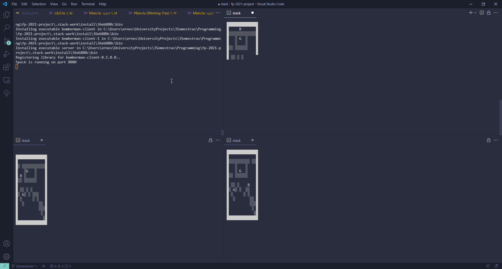

# Functional programming

This is basically a mirror of git.mif.vu.lt (Vilnius University gitlab repo) project me and my team did.

# Bomberman client.

The main idea of this project is to implement a bomberman game - a client and a web server.

In the picture you can see 3 games running at the same time.

  

# Details about the code

Code written in app1, app2 and most of app3 was written by Vilnius university lectuter.

Code in src is written by me and my team.

Hovewer all code in app4/ is written by me.